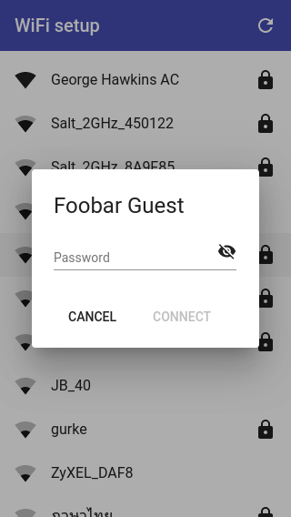

Material WiFi setup
===================

This project contains the [Angular](https://angular.io/) and [Angular Material](https://material.angular.io/guide/getting-started) resources that accompany my [MicroPython WiFi setup](https://github.com/george-hawkins/micropython-wifi-setup) project.

This project depends on both [Node.js](https://nodejs.org/en/about/) and [Python](https://www.python.org/). Check that both are installed:

    $ node --version
    v13.12.0
    $ python3 --version
    Python 3.7.3

If they're not, see my notes on [installing Node.js](https://github.com/george-hawkins/snippets/blob/master/install-node-and-npm.md) and on [installing Python](https://github.com/george-hawkins/snippets/blob/master/install-python.md).

For development or to demonstrate the frontend, provided by this project, you need a test server to simulate the backend.

So open two terminal sessions, one to run the test server and one to run the frontend.

Running the test server
-----------------------

Before running the test server, set up a standard Python venv:

    $ cd test-server
    $ python3 -m venv env
    $ source env/bin/activate
    $ pip install --upgrade pip

Once set up, the `source` step is the only one you need to repeat - you need to use it whenever you open a new terminal session in order to activate the environment. If virtual environments are new to you, see my notes [here](https://github.com/george-hawkins/snippets/blob/master/python-venv.md).

Then install [Flask](https://flask.palletsprojects.com/) and [APScheduler](https://apscheduler.readthedocs.io/en/stable/userguide.html):

    $ pip install Flask
    $ pip install apscheduler

Finally, run the server like so:

    $ export FLASK_APP=server.py
    $ flask run

Note: one of the packages that Flask depends on needs a Unicode locale, so it didn't like that I had `LANG=C`. This was easy to fix with:

    $ export LC_ALL=en_US.utf-8

To test that things are running properly, open another terminal session and run:

    $ curl -v http://localhost:5000/api/access-points

It should return a JSON formatted list of dummy access points (with a delay of a few seconds to mimic the behavior of the real backend).

**Notes:** for more details about the test server, see [`test-server/README.md`](test-server/README.md).

Building and serving the frontend
---------------------------------

If you've just set up the test server then leave it running, open a new terminal session and make sure you're in the project's root directory (and not in the `test-server` subdirectory).

The frontend requires [npm](https://en.wikipedia.org/wiki/Npm_(software)) and the [Angular CLI](https://cli.angular.io/), so first install the latest versions of both:

    $ npm install -g npm
    $ npm --version
    6.14.4
    $ npm install -g @angular/cli

The above commands work both for initial installation and for upgrading.

Note: the `-g` means global (and is used for installing command line tools). If `npm` complains that it can't install into some global system location, I strongly suggest that instead of running these commands with `sudo`, you switch to an approach that does not require root access, e.g. by using `nvm` (as described in my notes on [installing  `node`](https://github.com/george-hawkins/snippets/blob/master/install-node-and-npm.md)) or by setting the `npm` `prefix` value (as described [here](https://github.com/sindresorhus/guides/blob/master/npm-global-without-sudo.md)).

Normally, I like to check the version of things after installing them. However, if you try this with `ng`, it will fail as it depends on the `node_modules` directory which isn't present until the next step is completed (this is a known bug - see [#10917](https://github.com/angular/angular-cli/issues/10917)).

Now that things are setup, you can install the dependencies defined in [`package.json`](package.json):

    $ npm install

This will create a subdirectory called `node_modules` containing a really surprising number of direct and transient (indirect) dependencies.

Now, we can check the `ng` version:

    $ ng --version
    ...
    Angular CLI: 9.1.0
    Node: 13.12.0

Installation is complete and you can now run a development server that will serve the frontend (and automatically route through to the Python based test server for backend requests):

    $ ng serve --open

When served like this, the frontend will automatically reload if you change any of the source files.

The `--open` flag will cause it to automatically open a tab in your current browser - you should see a list of dummy access points (the ones you can see in the background in the picture above).

These are _dummy_ access points, you can click on any of them and enter any password you like - the test backend responds depending on what you enter, e.g. it'll respond with `OK` to a password containing the substring "good", e.g. "good1234" (to get it to respond with `FORBIDDEN` and other HTTP status codes, see [`test-server/README.md`](test-server/README.md)).

Note: passwords must be at least 8 characters long (a restriction specified in IEEE Std. 802.11i-2004, Annex H.4.1 - see the WPA-Personal section of the Wikipedia [WPA page](https://en.wikipedia.org/wiki/Wi-Fi_Protected_Access)).

By default the server only listens on the loopback address, to listen on all interfaces, so that you can access it from another device, use `--host`:

    $ ng serve --host 0.0.0.0

To build a set of files suitable for production deployment:

    $ ng build --prod

Supported browser versions
--------------------------

Currently the [`browserlist`](browserlist) file for this project only specifies browsers that support es2015, i.e. a relatively modern version of JavaScript. This includes the latest versions of Chrome, Safari, Firefox and Edge - and their iOS and Android variants - but excludes Internet Explorer and the kind of browsers typically found on feature phones. For more about this, see [here](docs/NOTES.md#ng-build-and-es5).

Notes
-----

For more details about this project and how it was created, see [`docs/NOTES.md`](docs/NOTES.md).
