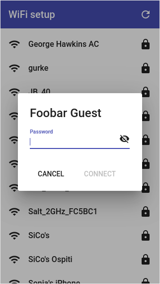

WiFi setup material
===================

This project contains the [Angular](https://angular.io/) and [Angular Material](https://material.angular.io/guide/getting-started) resources that accompany my [ESP32 setup](https://github.com/george-hawkins/esp32-setup) project.

This project depends on both [Node.js](https://nodejs.org/en/about/) and [Python](https://www.python.org/). Check that both are installed:

    $ node --version
    v13.12.0
    $ python3 --version
    Python 3.8.2

If they're not, see the sections down below on installing them.

For development or to demonstrate the frontend, provided by this project, you need a test server to simulate the backend.

So open two terminal sessions, one to run the test server and one to run the frontend.

### Running the test server

Before running the test server setup a standard Python [venv](https://docs.python.org/3/tutorial/venv.html):

    $ cd test-server
    $ python3 -m venv env
    $ source env/bin/activate
    $ pip install --upgrade pip

Once setup, the `source` line is the only one you need to repeat to activate the venv in future terminal sessions.

Then install [Flask](https://flask.palletsprojects.com/) and [APScheduler](https://apscheduler.readthedocs.io/en/stable/userguide.html):

    $ pip install Flask
    $ pip install apscheduler

Finally, run the server like so:

    $ export FLASK_APP=server.py
    $ flask run

Note: one of the packages that Flask depends on needs a Unicode locale, so it didn't like that I had `LANG=C`. This was easy to fix with:

    $ export LC_ALL=en_US.utf-8

To test that things are running properly, open another terminal session and run:

    $ curl -v http://localhost:5000/api/access-points

It should return a JSON formatted list of dummy access points.

**Notes:** for more details about the test server, see [`test-server/README.md`](test-server/README.md).

### Running the frontend

The frontend requires [npm](https://en.wikipedia.org/wiki/Npm_(software)) and the [Angular CLI](https://cli.angular.io/), so first install the latest versions of both:

    $ npm install -g npm
    $ npm --version
    6.14.4
    $ npm install -g @angular/cli
    $ ng --version
    ...
    Angular CLI: 9.1.0
    Node: 13.12.0

The above commands work both for initial installation and for upgrading.

Note: the `-g` means global (and is used for installing command line tools). If `npm` complains that it can't install into some global system location, I strongly suggest that instead of running these commands with `sudo`, you switch to an approach that does not require root access, e.g. by using `nvm` (as described in the section down below on installing `node`) or by setting the `npm` `prefix` value (as described [here](https://github.com/sindresorhus/guides/blob/master/npm-global-without-sudo.md)).

Now that things are setup, you can install the dependencies defined in [`package.json`](package.json):

    $ npm install

This will create a subdirectory called `node_modules` containing a really surprising number of direct and transient (indirect) dependencies.

Now you can run a development server that will serve the frontend (and automatically route through to the Python based test server for backend requests):

    $ ng serve --open

The `--open` flag will cause it to automatically open a window in your current browser - you should see a list of dummy access points (the ones you can see in the background in the picture above).

These are _dummy_ access points, you can click on any of them and enter any password you like - the test backend responds depending on what you enter, e.g. it'll respond with `OK` to a password containing the substring "good", e.g. "good1234" (to get it to respond with `FORBIDDEN` and other HTTP status codes, see [`test-server/README.md`](test-server/README.md)).

Note: passwords must be at least 8 characters long (a restriction specified in IEEE Std. 802.11i-2004, Annex H.4.1 - see the WPA-Personal section of the Wikipedia [WPA page](https://en.wikipedia.org/wiki/Wi-Fi_Protected_Access)).

By default the server only listens on the loopback address, to listen on all interfaces, so that you can access it from another device, use `--host`:

    $ ng serve --host 0.0.0.0

When served like this, the frontend will automatically reload if you change any of the source files.

To build a set of files suitable for production deployment:

    $ ng build --prod

**Notes:** for more details about this project and how it was created, see [`NOTES.md`](NOTES.md).

Installing node and npm
-----------------------

The easiest way to install node (and npm) is with [nvm](https://github.com/nvm-sh/nvm) (nvm allows easy version management and doesn't require root access). To install on Mac or Linux:

    $ curl -o- https://raw.githubusercontent.com/nvm-sh/nvm/v0.35.3/install.sh | bash

See the `0.35.3` in the URL? That was the current version at the time of writing, find the latest version [here](https://github.com/nvm-sh/nvm/tags).

This installation step updates your `~/.bashrc` so open a new terminal session, to pick up these changes,  or just force a reload of `~/.bashrc` like so:

    $ exec $SHELL

Now use nvm to install the latest version of node (and with it npm):

    $ nvm install node
    $ node --version
    v13.12.0
    $ npm --version
    6.14.4

Installing Python
-----------------

On Mac the easiest way to install Python is with [Homebrew](https://brew.sh/):

    $ brew install python
    $ python3 --version
    Python 3.7.7

And on Ubuntu just use `apt`:

    $ sudo apt install python3
    $ python3 --version
    Python 3.7.3

That's it.

But there's an alternative - [pyenv](https://github.com/pyenv/pyenv). It allows easy version management and an approach that doesn't require root access.

To install on Mac or Linux:

    $ curl https://pyenv.run | bash

Then add the following three lines to your `~/.bashrc`:

    export PATH=$HOME/.pyenv/bin:$PATH
    eval "$(pyenv init -)"
    eval "$(pyenv virtualenv-init -)"

Open a new terminal session or just force a reload of `~/.bashrc` like so:

    $ exec $SHELL

Determine the latest Python version number [here](https://www.python.org/downloads/) and install it like so:

    $ pyenv install 3.8.2

It takes a while but once it's installed, set it as the version to use and check:

    $ pyenv global 3.8.2
    $ python --version
    Python 3.8.2
